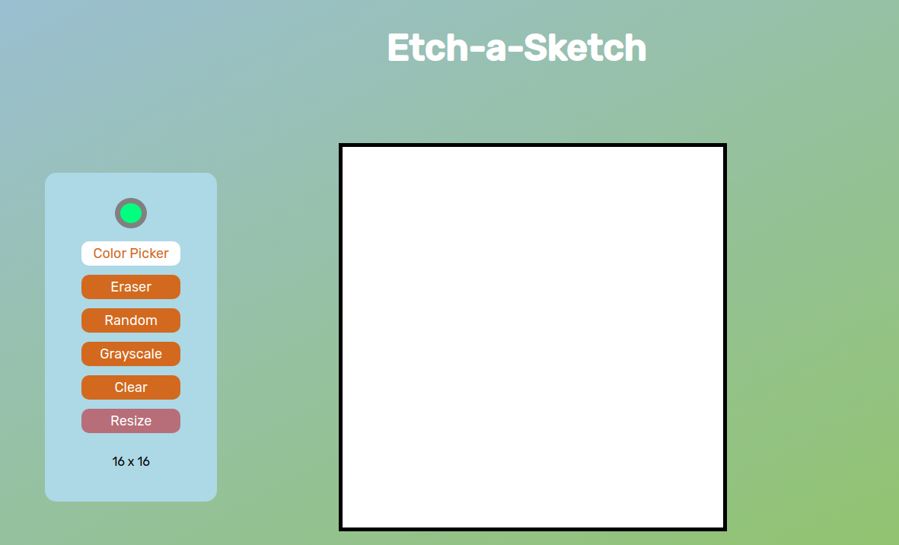

# Etch-a-Sketch

A simple webpage that mimics an etch-a-sketch. This project was built for personal learning from **The Odin Project** [curriculum](https://www.theodinproject.com/lessons/foundations-etch-a-sketch).

My **live demo** can be found [here](https://latsonj.github.io/etch-a-sketch/).

## 🛠️ Technologies used

 - **HTML5**
 - **CSS3**
 - **Vanilla JS**

## 📷 Screenshots

   

## 📝 Learning Observations

Making this project solidified the concepts of **DOM Manipulation** and **Event listeners** since every button press and mouse hover triggers slightly different functionality. I had to make sure the functions did not interfere with each other, the correct parts of the document were being manipulated, and events were added and removed correctly.

This project also allowed me to practice and reinforce concepts from previous projects which were heavily **HTML** and **CSS** focused.

Making the **grayscale** extra credit part was challenging, since I was trying to figure out how to reduce repetition on that particular function. Initially, I wrote every possibility down and even though it worked, it was a clumsy approach. Later, I figured out how to use substring methods and conditionals to make every pass 10% darker thus reducing the amount of repetitive code and adding to its readability.

Overall, I am satisfied with this project, but I can still work on reducing the repetitiveness of my code as a whole.

## Potential To-Dos

  - Click and drag drawing functionality

  ~- Slider for resizing grid replacing prompt~ ✓

  ~- General styling (I initially wanted to add an easel shape around the grid)~ ✓

## Attributions

Links that helped me:

  - [Make CSS gradient background](https://stackoverflow.com/questions/2869212/css3-gradient-background-set-on-body-doesnt-stretch-but-instead-repeats)
  - [Remove all children of a node](https://medium.com/front-end-weekly/remove-all-children-of-the-node-in-javascript-968ad8f120eb)

Color input styling from:

  - [Styling Input Type Color | Pure CSS Tutorial by Coding Artist](https://codingartistweb.com/2021/09/styling-input-type-color-pure-css-tutorial/)

This project was created with fonts and images from:

 - [Google Fonts (Rubik)](https://fonts.google.com/)
 - [Easel icons created by Graficon - Flaticon](https://www.flaticon.com/free-icons/easel)

## 👤 Author

Created by [latsonj](https://github.com/latsonj)